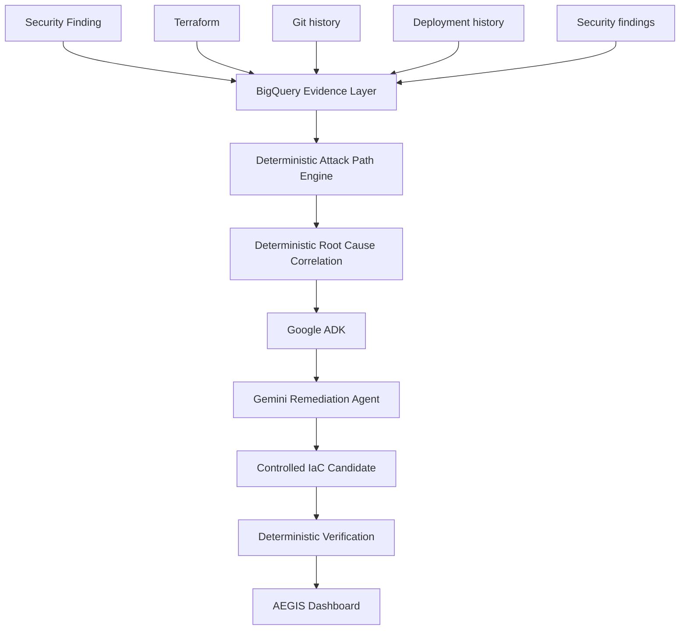

# AEGIS Architecture

## Decision boundary

The deterministic Python engine remains upstream of the AI remediation step. Gemini does not decide whether an attack path exists or whether the fix is verified.

## Evidence sources

- Terraform
- Git history
- deployment history
- security findings

## Operational notes

- BigQuery is used for evidence/correlation reads.
- Google ADK orchestrates the remediation workflow.
- Gemini is used only to generate a remediation proposal.
- Verification is always deterministic and authoritative.
